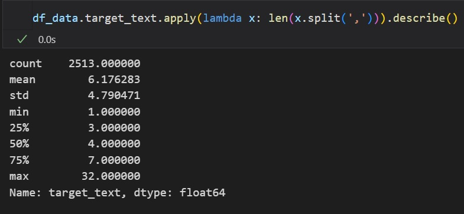

# news-topic-keyphrase-generation-model-dev

## Dev Objective

- 디코더 혹은 인코더-디코더 계열의 모델을 활용하여 신문기사를 입력으로 받아 토픽에 해당하는 key-phase를 생성하는 모델을 개발합니다.
- 모델 입출력 예시
  - 입력: 다음 달부터 15억 초과 주택 대출 허용…ltv 50%도 다음 달부터는 무주택자의 경우 규제 지역에서도 주택담보대출비율(ltv)이 (...)
  - 출력: 주택담보대출,ltv 규제 완화,dsr
- 한국어로 사전학습된 SBERT를 활용하여 KeyBERT 방법을 추가로 시험해볼 예정
  - [link to ref.](https://github.com/MaartenGr/KeyBERT)

## Model

- T5/GPT/BART 계열의 모델을 사용합니다.
- 본질적으로 요약 태스크에 준하는 경우이기 때문에 한국어 데이터를 활용해 신문기사 요약 학습이 되어 있는 모델을 추가로 탐색할 예정입니다.

## Data

- 웹크롤링을 통해 얻은 신문기사 제목과 본문(x)에 대하여 챗피티를 활용하여 토픽에 해당하는 key-phrase 라벨(y)을 생성하는 방식으로 구축된 데이터세트입니다.
- 현재 v1과 v2가 존재하며 시험 훈련에서는 2513개의 전체 샘플을 활용합니다.
  - v1: chatgpt 프롬프트 엔지니어링으로 생성한 라벨을 작업자가 검수한 데이터 셋
  - v2: gpt4 프롬프트 엔지니어링으로 생성한 라벨 (v1에 비해 향상된 라벨 품질)
- train/eval 데이터는 초기 훈련에서 전체 데이터를 8:2로 나눠서 사용합니다.

## Metric

- 시험 훈련에서는 Eval Loss를 기준으로 오버피팅 전에 얼리 스타핑하여 휴먼 이밸류에이션을 진행합니다.
  - 개발 모델이 생성하는 key-pharase가 훈련 데이터에 준하게 생성이 되는지 확인합니다.\
- 추후에는 F1 스코어 계산 함수를 작성하여 모델 개발에 활용합니다.'
  - [link to ref.](https://huggingface.co/ml6team/keyphrase-generation-t5-small-inspec?text=In+this+work%2C+we+explore+how+to+learn+task+specific+language+models+aimed+towards+learning+rich+representation+of+keyphrases+from+text+documents.+We+experiment+with+different+masking+strategies+for+pre-training+transformer+language+models+%28LMs%29+in+discriminative+as+well+as+generative+settings.+In+the+discriminative+setting%2C+we+introduce+a+new+pre-training+objective+-+Keyphrase+Boundary+Infilling+with+Replacement+%28KBIR%29%2C+showing+large+gains+in+performance+%28up+to+9.26+points+in+F1%29+over+SOTA%2C+when+LM+pre-trained+using+KBIR+is+fine-tuned+for+the+task+of+keyphrase+extraction.+In+the+generative+setting%2C+we+introduce+a+new+pre-training+setup+for+BART+-+KeyBART%2C+that+reproduces+the+keyphrases+related+to+the+input+text+in+the+CatSeq+format%2C+instead+of+the+denoised+original+input.+This+also+led+to+gains+in+performance+%28up+to+4.33+points+inF1%40M%29+over+SOTA+for+keyphrase+generation.+Additionally%2C+we+also+fine-tune+the+pre-trained+language+models+on+named+entity+recognition%28NER%29%2C+question+answering+%28QA%29%2C+relation+extraction+%28RE%29%2C+abstractive+summarization+and+achieve+comparable+performance+with+that+of+the+SOTA%2C+showing+that+learning+rich+representation+of+keyphrases+is+indeed+beneficial+for+many+other+fundamental+NLP+tasks.)

## Progress

### Test Training

1. 'paust/pko-t5-base'
  - [log](https://wandb.ai/dotsnangles/news-topic-keyphrase-generation-model-dev)
  - 코사인 스케쥴러를 적용하여 30에폭 훈련 진행 중이나 15에폭 이후로 로스와 루즈 스코어가 모두 정체
  - ROUGE1 기준으로 22를 넘기 어려울 것으로 보임
  - 훈련을 끝까지 마친 뒤 Best CKPT의 추론 결과를 토대로 훈련 데이터 보완 혹은 설계 개선이 필요할 수 있음
  - ainize/kobart-news 및 ainize/gpt-j-6B-float16를 훈련해 베이스라인을 잡을 예정
  - ainize/kobart-news의 경우 요약 데이터로 훈련이 된 모델이라 타 모델과 비교해 높은 성능을 낼 가능성이 있음
  - 현재 데이터의 샘플 별 키프레이즈의 갯수가 크게 상이하여 최대 5개에서 10개 사이로 제한해 전처리한 뒤 훈련을 진행해볼 필요가 있음
    - 토큰화 후 토큰 갯수가 2개부터 156개
    - keyphrase 객체 수 기준으로는 아래와 같음 (3분위수 기준 7개)
    - 
  - 보다 나은 품질의 v2 데이터에 키프레이즈 개체수를 7개로 제한하는 전처리 로직을 추가하여 훈련 예정
    - paust/pko-t5 / ainize/kobart-news / ainize/gpt-j-6B-float16 세 개 모델을 모두 테스트한 뒤 베이스라인을 잡음

### Baseline Set up

1. Data
  - news_topic_trainset2.json / news_topic_validset2.json
  - 추후 추가될 수도 있는 데이터와 현재 데이터의 일관성을 유지하기 위해 v2만 사용
    - GPT4로 라벨링한 데이터
  - 총 1585개 샘플
  - 현재 seperator는 ','
  - 추가적인 라벨 정제를 수행함
    - 앞뒤로 seperator가 붙어 있는 경우가 있어 삭제
    - 이상값에 가까울 정도로 키프레이즈가 많은 라벨이 있어 키프레이즈의 갯수를 7개로 제한
  - preprocess_v2.pickle
  - input data의 max_len을 좀 더 확보하기 위해 prefix를 간소화 ("generate keyphrases: ")

2. Model
  - paust/pko-t5-base / ainize/kobart-news / ainize/gpt-j-6B-float16
  - ainize/gpt-j-6B-float16는 훈련에 필요한 리소스가 큰 관계로 작은 모델로 실험을 선 진행

3. training args
  - batch_size: 2
  - learning_rate: 3e-6 * NGPU
  - lr_scheduler: cosine without warm-up
  - optimizer: adamw
  - metric_for_best_model: eval_loss
  - max_input_length: 512
  - max_target_length: 128
  - generation method for evaluation: greedy search

4. Results
   1. ./results 참조
   2. 시험 훈련에 비해 전반적으로 개선된 출력을 얻었으나 T5의 경우 BOS 토큰이 따로 없어 키프레이즈 구분자인 ','로 생성이 시작되는 경우가 종종 발견됨
      1. T5 계열 모델의 경우 EOS토큰은 존재하기 때문에 이를 그냥 BOS로 사용해도 괜찮을 듯함
   3. batch_size를 8로 에폭을 30으로 변경한 ainize_kobart_news_v2_run_2.txt의 결과가 보기에 가장 좋은 모습이었음
   4. F1 스코어를 메트릭으로 사용하는 것은 좀 더 고려가 필요할 것으로 보임
      1. 키프레이즈를 완전히 동일하지는 않더라도 비슷하게 생성하는 경우나 생성된 키프레이즈의 순서가 라벨의 순서와 다를 경우 모두 오답 처리하는 방식이기 때문에 문제가 있어보임
      2. 현재 ROUGE 스코어는 유니그램 기준으로 20 내외를 기록하고 있음
      3. 요약 태스크를 기준으로는 70 이상일 시 준수한 성능을 발휘하지만 키프레이즈 생성의 경우 스코어 기준을 좀 더 낮게 잡아도 결과가 괜찮을 듯함
      4. Greedy Search 방식으로 ROUGE1을 35 이상으로 올릴 수 있는 방법을 찾아봐야 함
         1. Greedy Search 방식으로 어느 정도 정돈된 결과가 나온다면 빔서치나 샘플링 등의 제너레이션 기법을 적용해 결과를 확인해볼 수 있음
      5. 영자신문 샘플이 몇몇 존재하는데 한국어 샘플에 대해서만 훈련을 진행하고 결과를 살펴볼 필요가 있음
      6. 좀 더 실험을 진행해보고 결과가 미진할 경우 샘플을 1만건 정도 더 구축을 해보는 것도 방법일 듯함
         1. 챗지피티 API를 통해 라벨링 자동화가 가능한지 확인해봐야 함 (가능)

### Generate more sample with GPT 3.5 Turbo

1. openai api를 활용하여 1만건의 샘플을 추가로 생성합니다.
  - 프롬프트 엔지니어링 결과 예시
  - role: you are a data labeller who finds key-phrases in a news article.
  - response: Sure, I can help you find key-phrases in a news article. Please provide me with the article, and I will analyze it to identify the most important and relevant phrases.
  - prompt: find top 10 most important key-phrases in the article and separate the key-phrases with semi-colons; numbering is not needed; don't start or end it with any punctuation: NH농협은행, ‘농협이 곧 ESG’, 상생경영 시동건다 (...)
  - reponse: NH농협은행; ESG경영; 환경·사회책임·지배구조; 금융사; 비재무적 노력; 대한민국 리딩금융 ESG 어워드; 농협이 곧 ESG; 녹색금융 상품; NH친환경기업우대론; NH녹색성장론; 최우수상
2. 한국어 신문기사만 사용
3. 결과적으로 GPT 3.5 Turbo 수준의 key-phrase 생성 모델 구축을 목표로 함
4. DB에 축적된 신문기사 샘플을 살펴볼 필요